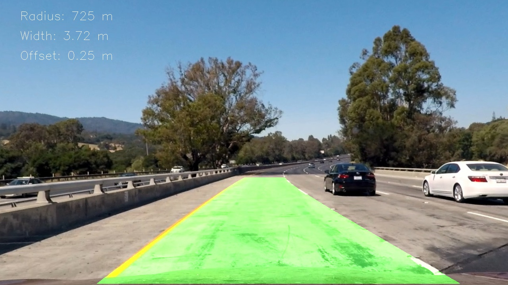
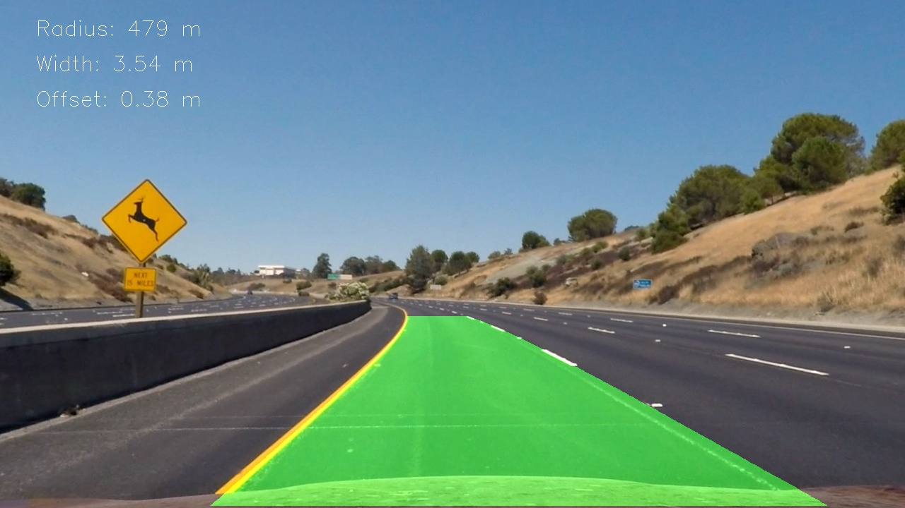
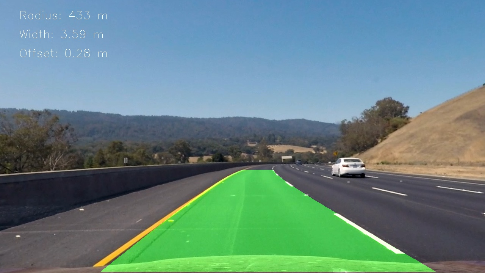
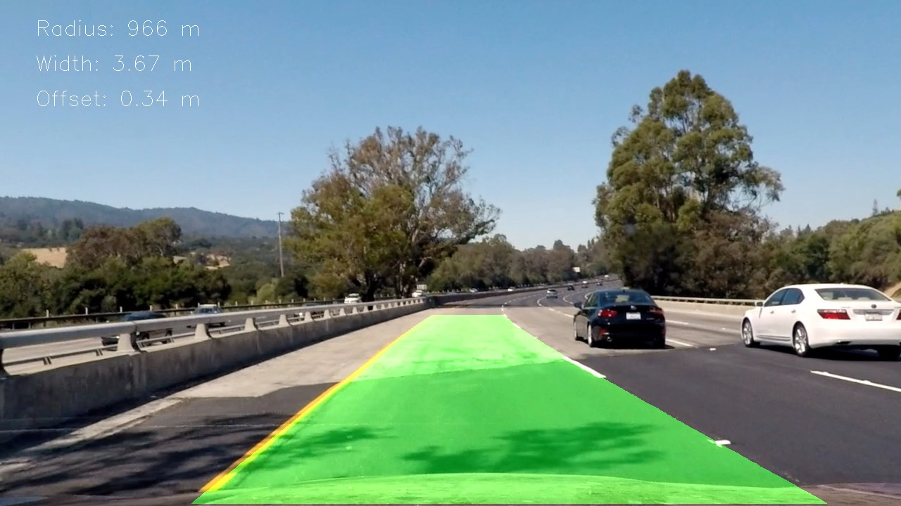
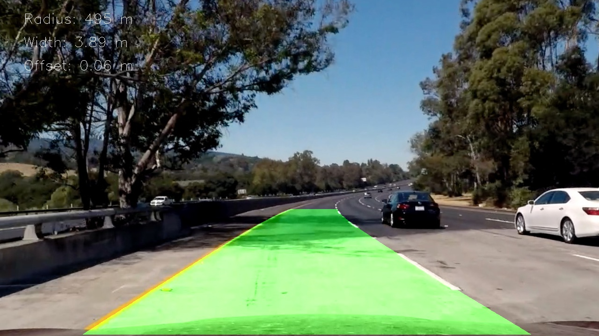
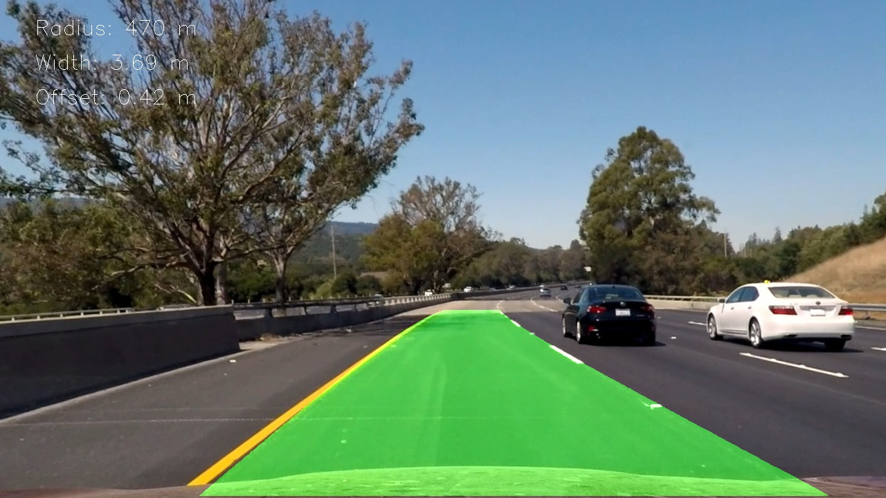

# Advanced Lane Finding Project - Writeup

## Project goals

The goals / steps of this project are the following:

* Compute the camera calibration matrix and distortion coefficients given a set of chessboard images.
* Apply a distortion correction to raw images.
* Use color transforms, gradients, etc., to create a thresholded binary image.
* Apply a perspective transform to rectify binary image ("birds-eye view").
* Detect lane pixels and fit to find the lane boundary.
* Determine the curvature of the lane and vehicle position with respect to center.
* Warp the detected lane boundaries back onto the original image.
* Output visual display of the lane boundaries and numerical estimation of lane curvature and vehicle position.

## Rubric Points

### Here I will consider the [rubric points](https://review.udacity.com/#!/rubrics/571/view) individually and describe how I addressed each point in my implementation. All the implementation is in the [`lanes_advanced.ipynb`](lanes_advanced.ipynb) notebook.


---

### Writeup / README

#### 1. Provide a Writeup / README that includes all the rubric points and how you addressed each one.  You can submit your writeup as markdown or pdf.  [Here](https://github.com/udacity/CarND-Advanced-Lane-Lines/blob/master/writeup_template.md) is a template writeup for this project you can use as a guide and a starting point.  

You're reading it!

### Camera Calibration

#### 1. Briefly state how you computed the camera matrix and distortion coefficients. Provide an example of a distortion corrected calibration image.

The code for this step is contained in the **Calibration** section of the IPython notebook.  

I start by preparing "object points", which will be the (x, y, z) coordinates of the chessboard corners in the world. Here I am assuming the chessboard is fixed on the (x, y) plane at z=0, such that the object points are the same for each calibration image.  Thus, `objp` is just a replicated array of coordinates, and `objpoints` will be appended with a copy of it every time I successfully detect all chessboard corners in a test image.  `imgpoints` will be appended with the (x, y) pixel position of each of the corners in the image plane with each successful chessboard detection.  

I then used the output `objpoints` and `imgpoints` to compute the camera calibration and distortion coefficients using the `cv2.calibrateCamera()` function.  I applied this distortion correction to the test image using the `cv2.undistort()` function. I also used `cv2.getPerspectiveTransform()` and `cv2.warpPerspective()` to test how chessboard can be warped to a rectangular grid. 

Here is the original image on the left, undistorted one in the middle, and warped on the right:


I saved distortion coefficients to `camera_cal/mtx_dist.p` for later reuse.

### Pipeline (single images)

#### 1. Provide an example of a distortion-corrected image.

I applied distortion correction to `straight_lines1.jpg` and got the following output:


It's hard to see the difference by eye, but supposively the lines are more straight.

#### 2. Describe how (and identify where in your code) you used color transforms, gradients or other methods to create a thresholded binary image.  Provide an example of a binary image result.

The code for this step is in the **Color transform** section of the notebook, which defines function `transform_threshold_binary()`. It essentially uses exact same code and thresholds from the class. Since it worked pretty well, I didn't see a need to improve it.

Here is an example of applying it to `test6.jpg` input image:


#### 3. Describe how (and identify where in your code) you performed a perspective transform and provide an example of a transformed image.

The code for this step is in the **Perspective transform** section of the notebook, which defines function `undistort_warp_transform()`.

I used [`straight_lines.jpg`](output_images/straight_lines1_undist.jpg) distortion-corrected image to manually mark a trapezoid along the straight lines - its corners are `[[195, 720], [570, 466], [714, 466], [1116, 720]]`.

I defined destination points in the warped image to be `[[640+(195-640)*0.75, 720], [640+(195-640)*0.75, 300], [640+(1116-640)*0.75, 300], [640+(1116-640)*0.75, 720]]`. The rationale to pick new `x` coordinates at `640+(195-640)*0.75` and `640+(1116-640)*0.75` is to push the lines towards the center, but keeping the center of the image unchanged, since we are o assume that the center of the image is actually the center of the car. I found this assumption to not be entirely correct, since in the final result I found a systematic offset from the center, but oh well. The rationale for top `y` at `300` is to get a longer portion of the line into the warped image than the marked trapezoid.

This resulted in the following source and destination points:

| Source        | Destination   | 
|:-------------:|:-------------:| 
| 195, 720      | 306, 720        | 
| 576, 466      | 306, 300      |
| 714, 466      | 997, 300      |
| 1116, 720     | 997, 720        |

I verified that my perspective transform was working as expected and producing approximately straight vertical lines for `straight_lines1.jpg` and `straight_lines2.jpg` test images


#### 4. Describe how (and identify where in your code) you identified lane-line pixels and fit their positions with a polynomial?

The code for this step is in the **Curvature** section of the notebook, which defines function `fit_curve()`.

I found, in my opinion, a cleaner and more robust solution than suggested in the lectures, which works as follows:

1. We start with warped binary thresholded pixels


1. Then apply Gaussian smoothing `scipy.ndimage.filters.gaussian_filter(20)`


1. We then fit a second order polynomial directly on the image, by defining a `cost_fn()` which sums the intensity of the pixels along the polynomial path, and using `scipy.optimize.minimize()`. Since the cost function is defined numerically, we can't do a gradient descent, but the simplex based [Nelder-Mead](https://docs.scipy.org/doc/scipy/reference/optimize.minimize-neldermead.html#optimize-minimize-neldermead) works ok, because of Gaussian smoothing.

1. Because there is a risk to find a local minimum, we run optimiation from a few starting points - `[200, 300, 400]` for left lane, and `[900, 1000, 1100]` for right lane - and pick the best global fit. The result is great!


#### 5. Describe how (and identify where in your code) you calculated the radius of curvature of the lane and the position of the vehicle with respect to center.

The code for this step is also in the **Curvature** section of the notebook, which defines function `curve_geometry()`.

We have to find the conversion from warped image pixels to meters, which we guestimate as follows:
```python
ym_per_pix = 35/720 # image height ~35m long
xm_per_pix = 3.7/(997-306) # lane width 3.7m
```

Once we have the scaling, we convert the coefficients according to dimensionality:
```
A = Apix * xm_per_pix / ym_per_pix ** 2
B = Bpix * xm_per_pix / ym_per_pix
C = Cpix * xm_per_pix
```

Then the geometry calculation is straightforward. Note that in the curve-fitting we use `y` coordinate which is `0` at the bottom of the image, so that `C` coefficient gives the position of the lane near the car, which makes everything easier.
```
width = C_right - C_left
offset = (C_right + C_left)/2 - center
radius = (1 + B**2)**(3/2) / (2 * abs(A))
```

Although in radius calculation `B**2` contribution is completely negligible so essentially `radius = 1/(2*abs(A))`. We report average radius of left and right lanes.


#### 6. Provide an example image of your result plotted back down onto the road such that the lane area is identified clearly.

The full image pipeline is defined in notebook section **Pipeline** which defines function `process()`.

Besides the steps already described, it uses function `unwarp_transform_p()` to map polynomial pixels back to distortion-corrected image. The two lane polynomials are overlayed, together with the geometry information:








---

### Pipeline (video)

#### 1. Provide a link to your final video output.  Your pipeline should perform reasonably well on the entire project video (wobbly lines are ok but no catastrophic failures that would cause the car to drive off the road!).

The final step to process a video reliably was to handle small occasional glitches, when the fit is incorrect. A simple [exponential smoothing](https://en.wikipedia.org/wiki/Exponential_smoothing) of the coefficients with `alpha=0.2`, defined in `update_coef()` function, worked well.

Here is the final output video on YouTube:

[](https://www.youtube.com/watch?v=TCwLMjJpEdc&)

and [mp4 file](output_videos/project_video.mp4).

---

### Discussion

#### 1. Briefly discuss any problems / issues you faced in your implementation of this project.  Where will your pipeline likely fail?  What could you do to make it more robust?

I'm very happy with the pipeline and the curve-fitting approach that I found.

The curve geometry might be somewhat inaccurate - I'm reporting ~400m radius on the initial curve instead of ~1000m. Probably the conversion coefficient `ym_per_pix` needs to be estimated more accurately (the 35m value for vertical distance is really a rough guesstimate). There is also a systematic offset of ~40cm from the middle of the lane, which probably needs to be corrected.

Another drawback of the pipeline is that it's currently quite slow - takes ~300ms to process one frame. A large part of it is due to Gaussian smoothing with sigma=20, which produces a huge kernel. The `minimize()` calls also take some time, but they are relatively fast. I think the performance of both pieces can be quite easily improved by shrinking the image size significantly.

The pipeline fails, however, quite miserably on [challenge_video.mp4](output_videos/challenge_video.mp4). I think it's because the lane is narrower, and there are features on the road (the wall, shadow, differences in surface) which get picked up by the thresholding and get mistaken for a line. Probably would need to work harder on producing a good thresholded binary image. Also, one would probably need to improve curve-fitting, perhaps by selecting more cleverly between different local minima, and building in expectation, for where the lane is most likely to be.